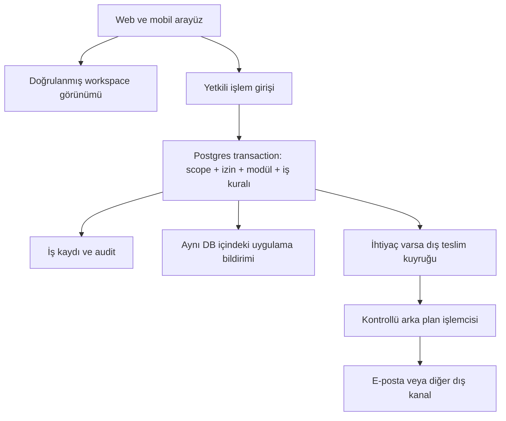

# BPS seçilebilir modüller — teknik mimari sağlamlaştırması v2

> Birleştirilmiş ana karar ve uygulama sırası: [Çalışma Alanı ve Ayarlar ana planı](../../01_product/CALISMA_ALANI_VE_AYARLAR_ANA_PLANI.md). Bu dosya ayrıntı/araştırma eki olarak korunur.

28 Eylül 2026 · Tasarım; uygulanmadı.
Referans kod `01c46b5`. [Ana plan](./uygulama-plani.md), [ürün envanteri](./modul-envanteri-ve-sektor-plani.md).
Bu belge ana planın teknik belirsizliklerini daraltır. Çelişen teknik ayrıntıda aşağıdaki v2 kararları geçerlidir; ürün kapsamındaki on modül ve mevcut yetkiler korunur.

## 1. Benchmarkları nasıl kullandık?

Resmi dokümanlar incelendi; bu şirketlerin özel kaynak kodlarını veya iç mimarilerini bildiğimiz iddia edilmiyor. Aşağıdaki BPS kararları dokümanlardan çıkarılmış önerilerdir, kopyalanmış sistem tasarımı değildir.

| Referans | Doğrulanan örüntü | BPS kararı | Almayacağımız karmaşıklık |
|---|---|---|---|
| Connecteam | İşlevler Operations/Communication/HR hub'larında seçilebiliyor | Anlamlı iş modülleri, az sayıda seçim | Her butonu ayrı ürün yapma |
| ClickUp ClickApps | Workspace ve desteklenen özelliklerde Space düzeyinde etkinleştirme | Önce tenant kapsamı; ekip düzeyi sonraya | Başlangıçta iç içe override katmanları |
| Zoho One | Uygulama kullanıcılara atanabiliyor | Modül tercihi ile kişi yetkisi ayrı | Her kullanıcı için on modül kopyası |
| Unleash | Backend değerlendirme ile frontend'e sonuç verme ayrımı | Tarayıcı yalnız değerlendirilmiş görünümü alır | Bu ölçek için ayrı flag sunucusu |
| OpenFeature | Değerlendirme bağlamı ve hedef öznesi tanımlanıyor | Açık tenant/actor bağlamı; global mutable context yok | Sırf standart var diye SDK bağımlılığı |
| AWS SaaS authorization | SaaS yetkilendirmesi ayrı bir mimari sorumluluk | Merkezi ilke, her erişim sınırında uygulama | Yeni OPA/Cedar servisi kurma |
| AWS transactional outbox | İş kaydı ve olay çift yazımındaki tutarsızlığı ele alıyor | Gereken asenkron dış etkiler için transaction içinde teslim niyeti | Kafka, CDC, mikroservis zorunluluğu |
| PostgreSQL | Permissive politikalar OR, restrictive politikalar AND birleşiyor | Mevcut politikayı bozmadan modül kısıtı; gerçek rollerle test | UI gizlemesini güvenlik sayma |

Kaynaklar ve erişim sınırları belgenin sonunda. Stripe entitlements giriş sayfası ürün özelliği erişimi kavramını doğruluyor; ayrıntılı varyant açılamadığı için webhook/lisans davranışına ilişkin uygulama kararı buradan çıkarılmadı.

## 2. Dört kavramı ayrı tut

1. **Tenant module setting:** Şirket bu iş modülünü kullanıyor mu? Kalıcı iş ayarı.
2. **Authorization:** Bu kullanıcı bu kayıtta bu eylemi yapabilir mi? Üyelik, rol, kayıt erişimi.
3. **Release control:** Bu sürüm/özellik güvenli şekilde yayına açıldı mı? Geliştirici/operasyon kontrolü.
4. **Commercial entitlement:** İleride paket bu özelliği kapsıyor mu? Bu tur uygulanmayacak ayrı ticari katman.

UI tercihi beşinci ve daha zayıf kavramdır: kullanıcı kısayolu gizleyebilir ama izin kazanamaz. Sektör bunların hiçbiri değildir; öneri üretir.

V1 yürütme kuralı: doğrulanmış scope + mevcut izin + ilgili tenant modülü + yayın kullanılabilirliği. Frontend flag sonucu tek başına mutasyona izin vermez. Acil bir kill switch'in bütün DB/istemci yollarında anında etkili olduğu, yalnız env flag varsa iddia edilmez. Güvenlik amaçlı acil durdurma ayrıca DB kapısı üzerinden yapılmalıdır.

Önerilen karar sonucu boolean yerine dar nesne: `{allowed, reason, module, configRevision}`. Nedenler yalnız gerekli arayüz açıklaması içindir; yabancı tenant/kayıt varlığını ifşa etmez. Bilinmeyen key deny, başarısız konfigürasyon ayrı error; ağ hatası müşteri tercihi gibi “kapalı” gösterilmez.

## 3. Tek uygulama içinde net modül sınırları

Next.js + Supabase/PostgreSQL kalır. Modül UI/action/service/SQL erişim noktalarıyla tanımlanır; her modül için ayrı deployment veya veritabanı kurulmaz.

Çapraz modül erişiminde sınırsız `SELECT *` yerine amaçla sınırlı DTO/projeksiyon:
- Personel Havuzu: aday iletişim/uygunluk; staffing kapalıysa atama geçmişi yok.
- Operasyon: görevlendirme için gerekli kişi kimliği/aktiflik; talent kapalıysa tüm görüşme ve ekler yok.
- Proje Raporlama: şube kimliği/adı; günlük talepleri ve aday kişisel bilgilerini almaz.
- Görev: ilişki kimliği bulunabilir, kaynak kapalıysa kaynağın gizli başlığı/önizlemesi hydrate edilmez.

`companies` kaydında finans alanları varsa customers erişimi bütün finans alanlarını otomatik açmamalı. Tabloya SELECT grant + RLS satır filtresi tek başına kolon gizlemez. Dar view/RPC/kolon grant kararı M0 matrisinde her hassas karma tablo için zorunlu. Aynı şekilde `ops_workers` tablosuna geniş OR modül policy eklemek paylaşım çözümü değildir.

## 4. Aynı scope'u tek seferde doğrulama

Kod gözlemi: `projectContext` auth, tenant ve role için ayrı çağrılar yapıyor. Bu, burada kanıtlanmış bir açık olarak etiketlenmiyor; modül konfigürasyonu dördüncü bağımsız çağrı olarak eklenmemeli.

Hedef bootstrap: `actorId, tenantId, role, selectionVersion, membershipVersion, configRevision, schemaVersion, catalogVersion, enabledModules` tek doğrulanmış RPC yanıtında birlikte okunur. İstemci expected actor/tenant/generation eşleşmesini doğrular. Büyük business payload bootstrap'a eklenmez.

Bu snapshot işlem izni değildir: her mutasyonda DB scope'u ve modülü tekrar doğrular. Karar için istemcinin yolladığı role/tenant listesi kullanılmaz. Kayıtla tenant uyuşmazlığı composite FK ve sunucu kontrolüyle reddedilir.

Kimlik veya tenant değiştiğinde cache temizlenir. Yalnız modül revision değişiminde tüm uygulamayı unmount edip taslakları kaybetmeyiz; etkilenen yüzeyler erişim açısından kapatılır, mevcut güvenli taslak akışı korunur.

## 5. Konfigürasyon sürümü ile protokol sürümünü ayır

Önceki plandaki tek `catalog_version` ayrımı yeterli değildi.

- `schemaVersion`: istemciye dönen JSON sözleşmesinin versiyonu.
- `catalogVersion`: hangi modül anahtarlarının tanımlı olduğu.
- `configRevision`: tenant seçimlerinin optimistic concurrency versiyonu.
- `membershipVersion / selectionVersion`: mevcut erişim ve şirket seçimi tazeliği.

Yeni modül eklenirken eski istemciyi bozmayacak sunucu projeksiyonu kullanılır. V1 endpoint V1 anahtar kümesini döndürür; eski parser'a keyfi yeni enum gönderilmez. V2 önce sunucuda desteklenir, sonra istemci çıkar. Eski sürümün tanımadığı modül için işlem yolu zaten olmamalıdır.

Tüm tenantlarda yeni katalogya göre zorunlu satırların tamamı migration ile eklenir; yeni modül varsayılan kapalı. İlk mevcut kapsam backfill'i açık olabilir, sonraki her yeni modülü otomatik açmak yanlış. Backfill tamamlanmadan desteklenen katalog sürümü yükseltilmez.

Ayar ekranındaki revision conflict tüm seçim transaction'ı içindir. Normal görev kaydetmek, ilgisiz duyuru ayarı değişti diye körlemesine conflict vermemeli: kendi iş kaydı revision'ı ve güncel gerekli modül kontrolü yeterli. Önizleme veya form anlamı değişmişse açık yeniden inceleme gerekir.

## 6. İki bağımlılık türü

Katalog `requires` ve `enhances` ilişkilerini ayrı tutar:

- `requires`: iş akışı bağımlılık olmadan gerçekten çalışmaz. Kapatma engeli.
- `enhances`: ek bağlam sağlar; yoksa ilgili bölüm sorgulanmaz. Modülü zorunlu kılmaz.
- Ortak altyapı üçüncü türdür; görünür modül seçiminde bağımlılık kartı sayılmaz.

Bağımlılık grafiği döngüsüz olmalı. CI: bilinmeyen key, self-edge, cycle, closure ve bağımlı kapatma kontrolleri. Modül anahtarını görünür ad değişince değiştirmeyiz. Silinen key tekrar farklı anlamla kullanılmaz; deprecated anahtar geçişi ayrıca migration ister.

DB'de de aynı izinli ilişkiler uygulanır. Kaynak tek manifest; değişen SQL üretim çıktısı gözden geçirilir ve yeni migration olarak commit edilir. Runtime'da TypeScript dosyası okuyarak DB güvenliği kurmaya çalışmayız.

## 7. Kapatma yaşam döngüsü: V1'i büyütmeden güvenli tut

V1 `enabled/disabled` olarak kalır. Açık iş varsa kapatma engellenir; liste ve çözüm bağlantıları gösterilir. Yeni üçüncü “kapanıyor” durumu bu aşamada eklenmez: hangi update'in tamamlamaya, hangisinin yeni iş üretmeye hizmet ettiğini her modülde ayrı tanımlamadan bu durum güvenli değildir.

Gerçek kullanımda aktif işlerden dolayı şirket modülü makul şekilde kapatamıyorsa sonraki ayrı karar: `draining` (yeni iş kapalı, mevcut işi sonuçlandırma açık). Şimdilik genel bir “force close” veya gizli admin bypass yok. Gereksiz uzun engeller M0'da gerçek status enumlarıyla gözden geçirilir: geçmiş iş, yarım iş ve aktif yükümlülük farklıdır.

Re-enable eski veriyi açar; kapalı dönemde ertelenen yüzlerce bildirimi göndermeye başlamaz. Eski bildirimin UI'da geçmiş olarak görünmesi ile yeni ses/e-posta üretmesi ayrı politika olur. V1 önerisi: kapalı kaynak kuyruğu `suppressed` terminal duruma geçer; tekrar açılınca otomatik replay yok.

## 8. Transaction ve kilit protokolü

Ana plandaki config `FOR SHARE` / ayar `FOR UPDATE` tasarımı korunur, şu şartlarla:

- Config satırı ilk iş-kilidi olmalı; sonra kimlik/üyelik ve business kilitleri proje genelinde belgelenmiş sırayı izlemeli.
- Kimlik ve kapsam ön kontrolü kilit öncesi yapılabilir; yetki ve modül kontrolü kilit sonrasında tekrar yapılır.
- Ayrı tabloda settings güncellemesini görme: kilit sonrası yeni SQL statement ile READ COMMITTED altında ayarlar okunur; kilit öncesi snapshot'tan boolean taşınmaz.
- Config değiştirici mevcut settings'i yalnız aynı config kilidi altında günceller; yöneticiye doğrudan tablo yazma grant'i verilmez.
- Aktif iş COUNT/EXISTS kontrolleri bu kilit sonrası yapılır. Kontrole dahil business state üreten tüm yollar aynı bariyere uymalı.
- Tenantlar arası transaction gerekmedikçe yok. Gerekiyorsa birden çok config satırı sabit tenant sırasıyla alınır; farklı tenant verisini birleştirme yetkisi yaratmaz.
- Günlük yazılar paylaşılan kilitte birbirini zorunlu seri hale getirmez. Yine de yük testi, uzun import parçaları ve ayar değişimi beklemeleri ölçülür.
- Deadlock/lock timeout güvenli hata üretir; sınırsız retry yok. İş komutu receipt'i varsa kısa sınırlı retry, yoksa önce belirsiz sonucu sorgula.

Doğrudan DML/RPC'lerin hangileri protokole dönüştürüldü listelenmeden modül kapatma açılmaz. Çözümü her RLS helper'da write lock alarak kurmayız: okuma yolları kilit ve yan etki taşımamalı.

## 9. RLS ve SECURITY DEFINER kontrol listesi

PostgreSQL policy birleşim kuralı nedeniyle ikinci bir permissive policy “modül açık” şartını eski politikalara AND etmez. Uygun yerde restrictive policy veya mevcut predicate içine AND eklenir. En az bir geçerli permissive policy gereksinimi ve USING/WITH CHECK ayrı sınanır.

- SELECT, INSERT, UPDATE, DELETE ayrı test edilir; UPDATE'in SELECT gereksinimi gözden kaçmaz.
- Helper recursion: konfigürasyon tablosunun policy'si kendisini tekrar sorgulayan helper'a döngü oluşturmaz.
- SECURITY DEFINER: tam signature, güvenli search_path, owner ayrıcalıkları, EXECUTE revoke/grant; erişilen record için tenant/module/role tekrar kontrol.
- Owner/BYPASSRLS/service_role ile yapılan test kullanıcı güvenliğini kanıtlamaz. Gerçek authenticated + JWT scope testleri gerekir.
- View, storage policy, export ve audit payload'ları da veri yüzeyi. View güvenlik davranışı kullanılan Postgres sürümünde doğrulanır.
- Publicly exposed eski RPC overload'ları unutulmaz. Fonksiyon yeniden yazıldığında bağımlı grant ve çağrı sözleşmesi ölçülür.
- Yeni kısıtlı projection devreye girince eski geniş `.from(...).select('*')` yolu açık bırakılmaz.

## 10. Bildirim teslimi: önce mevcut olanı doğru kullan

### Uygulama içi

Mevcut konuşma SQL kaynağında mesaj ve `ops_message_notifications` satırları aynı transaction içinde yazılıyor. Son etkin SQL tanımı M0'da doğrulanacak; bu iyi örüntüyü koruyabiliriz. Aynı Postgres'te görev ve alıcı bildirim satırı atomik yazılabiliyorsa sırf mimari olsun diye outbox eklenmez.

Bildirim anahtarı `tenant + source_event + recipient + kind`; görev tekrar atandığında yeni event/revision gerekir. Sadece task_id ile dedupe sonraki gerçek atamaları kaybettirir. Okundu bilgisi alıcıya aittir; backend güncel kaynak/kayıt erişimini kontrol eder.

### Dış e-posta / daha sonra push

Kodda `src/lib/email/notification-log.ts` stamp-first sınırını belgeliyor: stamp'ten sonra süreç çökerse gönderim kaçabilir. Bu kod okumasıdır; canlıda mesaj kaybolduğuna dair ölçüm değildir.

Yeni dış teslim ihtiyacı için iş transaction'ında küçük outbox kaydı, sonra bağımsız worker. Event payload mümkünse kimlikler ve sürüm; aday/mesaj içeriğini gereksiz çoğaltma. En az alanlar: id, tenant, source_module, source_event, recipient, channel, status, attempt_count, available_at, lease_token, lease_until, provider_message_id, safe_error_code.

Worker:
1. Sınırlı due kayıtları kısa transaction'da `FOR UPDATE SKIP LOCKED` ile seçer; lease token yazar, commit eder.
2. Dış çağrıdan önce tenant/modül/alıcı ve kaynak erişimini tekrar denetler.
3. Provider'a sabit idempotency key gönderir (provider gerçekten destekliyorsa ve süresi uygunsa).
4. Sonucu yalnız kendi lease token'ı hâlâ geçerliyse finalize eder. Eski worker yeni worker'ın sonucunu ezemez.
5. Geçici hatada sınırlı artan bekleme; kalıcı hatada failed, belirsiz dış teslimde unknown/reconcile; modül/alıcı uygunsuzsa suppressed.

`SKIP LOCKED` kuyruk tüketimi içindir; modül etkinliğini veya kapanma engelini kontrol ederken kullanılamaz. Kilitli aktif işi atlayıp “engel yok” denmez.

Provider kabul etti fakat worker ACK yazamadan çöktü: provider dedupe/reconcile yoksa exactly-once garanti edilemez. Kör tekrar yinelenen mail, hiç tekrar etmeme kaçan mail doğurabilir. Bilinmeyen durum görünür olmalı; “gönderildi” diye işaretlenmemeli.

Modül kapatma için network çağrısı boyunca DB kilidi tutulmaz. Kontrol ile provider çağrısı arasında kalan dar yarış yüzünden anlık sıfır teslim garantisi verilmez. Revoke edilmiş kullanıcının kişisel verisini e-posta metnine doldurmamak için içerik minimizasyonu ve kimlikli uygulama bağlantısı tercih edilir.

Bu outbox altyapısı M6 dış teslim gereksinimine bağlıdır. Modül ayarı için üç tablo tasarımı korunur; M1'e kullanımsız mesaj altyapısı yığılmaz. Mevcut cron'a modül denetimi eklemek ise M2 zorunluluğudur.

## 11. Cache, SSR ve dağıtık sunucu davranışı

- Yetkili sayfalar kişisel veri içeren public/shared cache kullanmaz. Next.js fetch/cache varsayımlarına güvenmek yerine ilgili route/service politikası açık tanımlanır.
- Aynı istek içinde context paylaşılır; sunucular arası kalıcı cache ilk sürümde gerekmez. Tenant/actor ayrımı olmayan process-global değişken yasak.
- UI cache anahtarı tenant + actor + membership/selection generation + config revision. Kayıt listesi filtre/sayfa anahtarları da mevcut kapsamına göre eklenir.
- Realtime veya BroadcastChannel yalnız “yeniden oku” sinyalidir; payload'daki enabled değeri yetki kaynağı değildir. Kanal kaçarsa focus/reload + sunucu denetimi doğru sonucu korur.
- DB ulaşılamıyorsa mevcut business data'nın stale biçimde yetkiliymiş gibi gösterilmesi yerine erişim doğrulama hatası; uygulama shell/login/şirket seçimi gibi kurtarma yüzeyleri çalışabilir.
- Revision güncellemesi business veri cache'lerini otomatik her yerde doğru yapmaz; kapalı kaynak sonuçları DOM'dan, arama index projeksiyonundan ve export menüsünden ayrıca kaldırılır.

## 12. Dosya ve aktarım sözleşmesi

Dosya saklama sağlayıcısı ile metadata DB'si tek transaction değildir. Upload reserve/finalize mevcut command akışlarına bağlanır. Reserve tenant+actor+module+object key+beklenen boyut/tür ile daraltılır; finalize dosya ve güncel izin kontrolü yapar. Sadece object prefix'ten tüm yetki çıkarılmaz.

Yetim upload cleanup ayrı bakım yoludur: modül kapalıyken kullanıcı işlemi kapalı olabilir fakat lease'i bitmiş, hiçbir iş kaydına bağlanmamış nesnenin güvenli temizliği sistem tarafından yapılabilmeli. Temizlik genel “kapalı modül hiçbir iş yapamaz” kuralının açık, dar istisnasıdır; silinen dosyalar için referans ve grace-period denetimi gerekir.

Excel'de her committed batch için receipt, scope, kaynak modül, içerik checksum ve sonuç sayısı tutulur. Yeni modül ayarı nedeniyle otomatik retry duplicate satır üretmez. Dışa aktarım başlangıcında ve uzun iş parçaları arasında erişim doğrulanır; kullanıcıya teslim edilmiş dosya geri alınamaz. Pending/failed import için kapatma engeli sonsuza dek kalmamalı: mevcut cancel/recover yolu ve lease süresi tanımlanır.

## 13. Migration uyumluluk matrisi

| DB / uygulama | İzin verilen durum |
|---|---|
| Eski DB + eski uygulama | Başlangıç |
| Genişletilmiş DB + eski uygulama | Yalnız tüm-açık konfigürasyon ve mevcut grant uyumluluğu korunuyorsa |
| Genişletilmiş DB + yeni okuyucu | Shadow karşılaştırma; müşteri kapatma UI'sı kapalı |
| Enforcement DB + yeni uygulama | Testlerden sonra modül seçimleri açılabilir |
| Enforcement DB + eski uygulama | Kullanıcıda hata üretebilir; güvenli rollback hedefi sayılmaz |
| Yeni katalog + bir önceki desteklenen istemci | Versiyonlu projection ve eski anahtarların korunduğu uyumluluk |

Contract migration (grant kaldırma/eski RPC'yi kapatma) eski client adaptörleri taşınmadan yapılmaz; kullanıcı modül kapatma da eski izin kapıları kapanmadan açılmaz. Aradaki pencere bakım veya tüm-açık yapılandırma altında yönetilir. İlgisiz eski kirli root dosyaları release'e girmez.

Rollback sadece modül-aware sürüme. Config backup ihtiyacı iş verisinin tam yedeği anlamına gelmez; ayar değişiklikleri audit/receipt üzerinden geri uygulanır ve yeni revision oluşur. Eski revision sayısını geri almak veya audit silmek yok.

## 14. İlave kabul testleri ve ölçümler

Ana plandaki T01–T26'ya ek:

| No | Deneme | Kanıt |
|---|---|---|
| T27 | Yeni katalog, eski istemci | Protokol uyumlu; tanımadığı modül açılmaz |
| T28 | Görev kaydederken ilgisiz modül değişimi | Yetkili görev boşa conflict olmaz; ilgili kapatma reddedilir |
| T29 | Aynı kullanıcı A/B tenant istekleri eşzamanlı | Server/context/cache karışmaz |
| T30 | Config SHARED kilidi bekleyen yazı; başka transaction settings'i kapatır | Kilit sonrası ayrı statement güncel kapalı değeri okur |
| T31 | Müşteri açık, finance kapalı | Müşteri DTO'sunda mali kolonlar/özet kaçmaz |
| T32 | Ortak kişi projeksiyonu | Operasyon kullanıcısına kapalı talent görüşme/ek içeriği gelmez |
| T33 | Dış teslim kabulü ardından worker çökmesi | unknown/reconcile veya doğrulanmış provider dedupe; sahte sent yok |
| T34 | Lease aşımı ve iki worker | Eski token sonucu güncelleyemez |
| T35 | Kapalı kaynağı tekrar açma | suppressed olaylar topluca yeniden gönderilmez |
| T36 | Kapanma engeli sorgusunda business row kilitli | SKIP LOCKED ile engel atlanmaz |
| T37 | Silinecek yetim dosyaya geçerli referans eklenir | Cleanup sahiplik/ref protokolü dosyayı korur |
| T38 | RLS restrictive policy + owner/BYPASSRLS ayrımı | Authenticated deny ile service rol davranışı ayrı kanıt |

Performans deneyleri sentetik ve tekrarlanabilir: 10/50 eşzamanlı kısa yazıcı + ayar değişimi; uzun import parçası; birden çok tenant; 1k/10k/50k listeler; cold/warm ekran. Bunlar kapasite iddiası değil ölçüm noktalarıdır. p95 ve timeoutlar baz sürümle kıyaslanır. Settings helper'ın satır başına pahalı tekrar sorgu üretip üretmediği EXPLAIN ile ölçülür; optimizer hakkında peşin garanti yok.

CI yalnız regex dosya aramasından ibaret olmaz: public RPC exact-signature/grant snapshot, policy matrisi, yeni endpointlerin yüzey haritasında karşılığı, import boundary kontrolü, gerçek DB negatif senaryoları. Statik tarama dinamik çağrıları ispatlayamaz; açık istisna listesi ve manuel inceleme gerekir.

## 15. Net karar özeti

Şimdi zorunlu: tek scope bootstrap, ayrık versiyonlar, requires/enhances ayrımı, kolon/projeksiyon güvenliği, write barrier, idempotency, modül-aware dosya/cron, uyumlu rollout.

Gerektiğinde: dış mesaj outbox/lease (M6), draining yaşam döngüsü, merkezi cache, tenant altı bölüm seçimi.

Şimdi gereksiz: mikroservis, yeni broker, Unleash/OpenFeature kurulumu, ödeme/lisans motoru, plugin mimarisi. Benchmarkların prensiplerini alıyoruz; altyapılarını bütünüyle kurmuyoruz.

Kodlama giriş kapısı M0 yüzey haritası ve son DB tanımlarının ölçümü olmaya devam eder. Bu tasarım test edilmeden güvenliği sağlanmış veya üretime hazır sayılmaz.

## Kaynaklar

- [Connecteam paket yaklaşımı](https://help.connecteam.com/en/articles/608571-what-are-the-costs-of-the-platform)
- [ClickUp ClickApps](https://help.clickup.com/hc/en-us/articles/6304327753111-Intro-to-ClickApps)
- [Zoho One uygulama atama](https://help.zoho.com/portal/en/kb/one/admin-guide/applications/managing-applications/articles/zohoone-assign-app-individually)
- [Unleash mimari ayrımı](https://docs.getunleash.io/get-started/unleash-overview)
- [OpenFeature değerlendirme bağlamı](https://openfeature.dev/specification/sections/evaluation-context/)
- [AWS SaaS yetkilendirmesi](https://docs.aws.amazon.com/prescriptive-guidance/latest/saas-multitenant-api-access-authorization/introduction.html)
- [AWS transactional outbox](https://docs.aws.amazon.com/prescriptive-guidance/latest/cloud-design-patterns/transactional-outbox.html)
- [PostgreSQL RLS](https://www.postgresql.org/docs/current/ddl-rowsecurity.html)
- [PostgreSQL SELECT/kilit maddeleri](https://www.postgresql.org/docs/current/sql-select.html)
- [Stripe entitlements giriş sayfası — sınırlı kanıt](https://docs.stripe.com/billing/entitlements)

Kaynakların varlığı BPS implementasyonunun testini ikame etmez. Bu tur kaynak araştırması, hedefli kod okuması ve tasarım revizyonudur; canlı DB'ye migration uygulanmadı.
